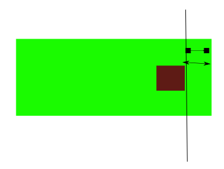

cytoscape-compound-resize
================================================================================


## Description

A Cytoscape.js extension to resize compound nodes by setting their paddings. Note that this extension do not handle the cases where the position or the sizes of the nodes are changed programaticly. It handles the position changes
if the node/s are moved by UI regularly and it handles the node resize if the node is resized through cytoscape.js-node-resize extension.

The extension enables users to have two modes ('free' and 'min').

In 'free' mode you have what is Cytoscape.js core is already providing. However, in 'min' mode you can specify the minimum and 
maximum paddings that a compound can have for all sides. In this way you can create extra space inside the node and when a child of this node 
is moving around the borders of it the outer width of the compound may not change according to the maximum and minimum paddings. 

The following figure reflects the arrows used in the next images to represent padding, maximum padding and minimum padding.


The following image represents an arbitrary state of a compound node when the extension is in 'min' mode.


Suppose that minimum right padding and right padding of a compound as in the figure below  


While the child node is being dragged to the right the outer size of the node will be conserved by decreasing the right padding
until it comes to the state shown in the following figure where the right padding will be equal to the minimum right padding. 



After that point if the node will be dragged to the right then the outer width of the compound will increase as the padding could not be 
less than minimum padding and so can no more be decreased.

Think of the case where the right padding and the maximum right paddings of the compound are as in the figure below


While the child node is being dragged to the left the outer size of the node will be conserved by increasing the right padding
until it comes to the state shown in the following figure where the right padding will be equal to the maximum right padding. 


After that point if the node will be dragged to the left then the outer width of the compound will decrease as the padding could not be 
more than maximum padding and so can no more be increased.


## Dependencies

 * Cytoscape.js ^2.7.0
 * cytoscape.js-node-resize ^1.0.10 (Optional. Actually this is not a complete dependency. However, this extension listens noderesize events triggered by node-resize extension)


## Usage instructions

Download the library:
 * via npm: `npm install cytoscape-compound-resize`,
 * via bower: `bower install cytoscape-compound-resize`, or
 * via direct download in the repository (probably from a tag).

`require()` the library as appropriate for your project:

CommonJS:
```js
var cytoscape = require('cytoscape');
var compoundResize = require('cytoscape-compound-resize');

compoundResize( cytoscape ); // register extension
```

AMD:
```js
require(['cytoscape', 'cytoscape-compound-resize'], function( cytoscape, compound-resize ){
  compound-resize( cytoscape ); // register extension
});
```

Plain HTML/JS has the extension registered for you automatically, because no `require()` is needed.


## API

```js
var api = cy.compoundResize( mode ); // valid modes are 'free' or 'min'
```

The extension api provides users with the following functions. Note that for the padding parameters in the api functions you
should specify an object similar to the following one

```js
var paddings = {
    top: 5,
    bottom: 5,
    left: 5,
    right: 5
};
```

You do not have to specify all of the for corners. For example if you want to just set the top and left paddings you can use an 
object similar to

```js
var paddings = {
    top: 5,
    left: 5
};
```

```js
// Set the mode. If the mode is switched to 'free' it sets the paddings to the min paddings else if the mode is switched to
// 'min' it sets the extreme ( maximum and minimum ) paddings to the current original paddings.
api.setMode(newmode); 
// Get the current mode
api.getMode();
// This function returns directly if the mode is not 'min'. It sets the paddings of the nodes conditionally. 
// The paddings which are not between min and max paddings are not set.
api.setPaddings(nodes, paddings); 
// This function returns directly if the mode is not 'min'. Sets the extreme (min or max) paddings for the given nodes. 
// You can give 'min' or 'max' to the 'minOrMax' parameter. Also note that this operation checks if the rule of 'maxPaddings >= minPaddings'
// is broken and does not set extreme paddings if it will be broken. If the min paddings will be higher then or the maximum paddings will be
// lower then the original paddings then it sets the original paddings to the extreme paddings.
api.setExtremePaddings(nodes, paddings, minOrMax); 
// Get the minimum paddings of a given node. Returns null if the mode is not 'min'
api.getMinimumPaddings(node);
// Get the maximum paddings of a given node. Returns null if the mode is not 'min'
api.getMaximumPaddings(node);
```

Or you can destroy the extension

```js
cy.compoundResize( 'destroy' );
```


## Publishing instructions

This project is set up to automatically be published to npm and bower.  To publish:

1. Set the version number environment variable: `export VERSION=1.2.3`
1. Publish: `gulp publish`
1. If publishing to bower for the first time, you'll need to run `bower register cytoscape-compound-resize https://github.com/iVis-at-Bilkent/cytoscape.js-compound-resize.git`
